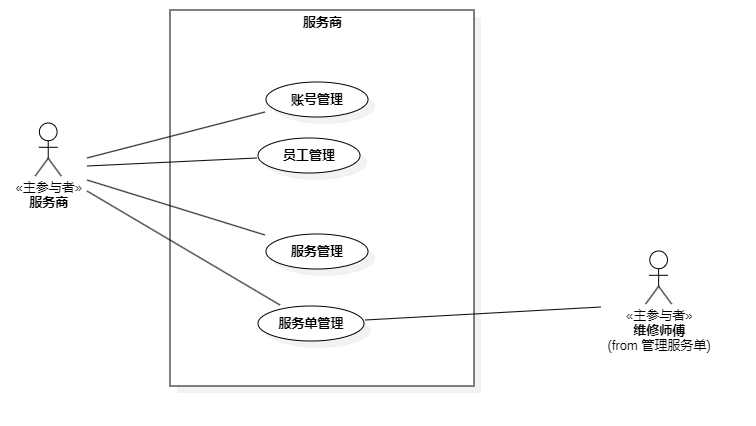
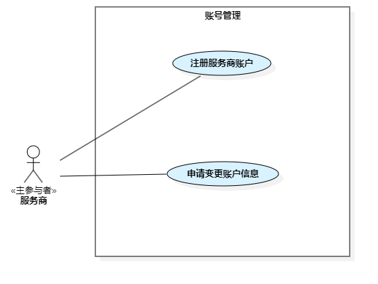
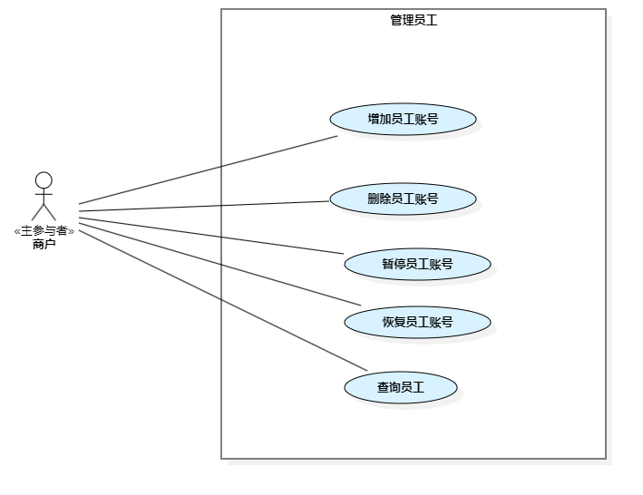
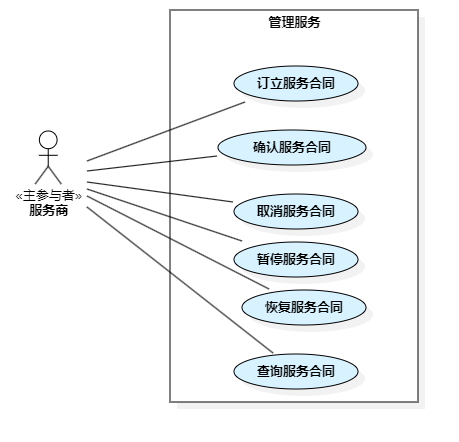
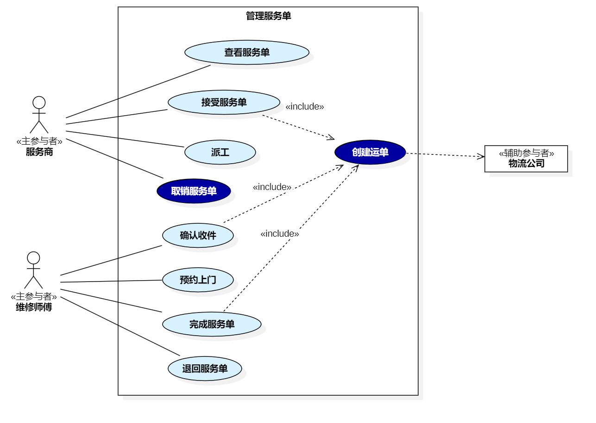

== 3.5 服务商

=== 3.5.1 账号管理

罗芳魁
include::serviceprovider/account-mgt/MALL-SERVICE-011-ApplyAccount.adoc[]
=== 3.5.2 员工管理

罗芳魁
include::serviceprovider/staff-mgt/MALL-SERVICE-020-AddStaff.adoc[]
罗芳魁
include::serviceprovider/staff-mgt/MALL-SERVICE-021-ChangeStaff.adoc[]

罗芳魁
include::serviceprovider/staff-mgt/MALL-SERVICE-022-SuspendStaffAccount.adoc[]

罗芳魁
include::serviceprovider/staff-mgt/MALL-SERVICE-023-ResumeStaffAccount.adoc[]

黄晨阳
include::serviceprovider/staff-mgt/MALL-SERVICE-025-DeleteStaffAccount.adoc[]

== 3.5.3 服务管理

王浩东
include::serviceprovider/service-mgt/MALL-SERVICE-043-CancelServiceContract.adoc[]
王浩东
include::serviceprovider/service-mgt/MALL-SERVICE-042-ConfirmServiceContract.adoc[]
王浩东
include::serviceprovider/service-mgt/MALL-SERVICE-044-SuspendServiceContract.adoc[]
王浩东
include::serviceprovider/service-mgt/MALL-SERVICE-045-RestoreServiceContract.adoc[]
吴王韬
include::serviceprovider/service-mgt/MALL-SERVICE-046-QueryServiceContract.adoc[]
=== 3.5.4 服务单管理

严可文
include::serviceprovider/serviceorder-mgt/MALL-SERVICE-031-AcceptServiceOrder.adoc[]
蔡欣琪
include::serviceprovider/serviceorder-mgt/MALL-SERVICE-035-ConfirmReceipt.adoc[]
罗芳魁
include::serviceprovider/serviceorder-mgt/MALL-SERVICE-032-QueryServiceOrder.adoc[]
王浩东
include::serviceprovider/serviceorder-mgt/MALL-SERVICE-036-CancelServiceOrder.adoc[]
吴王韬
include::serviceprovider/serviceorder-mgt/MALL-SERVICE-034-CompleteServiceOrder.adoc[]
蔡欣琪
include::serviceprovider/serviceorder-mgt/MALL-SERVICE-033-AssignServiceOrder.adoc[]
吴王韬
include::serviceprovider/serviceorder-mgt/MALL-DERVICE-037-SendBackServiceOrderr.adoc[]
吴王韬
include::serviceprovider/serviceorder-mgt/MALL-SERVICE-038-MakeAnAppointment.adoc[]