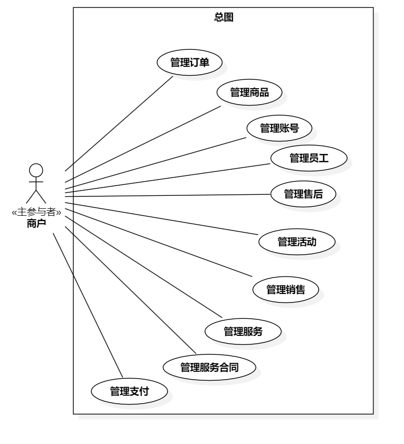
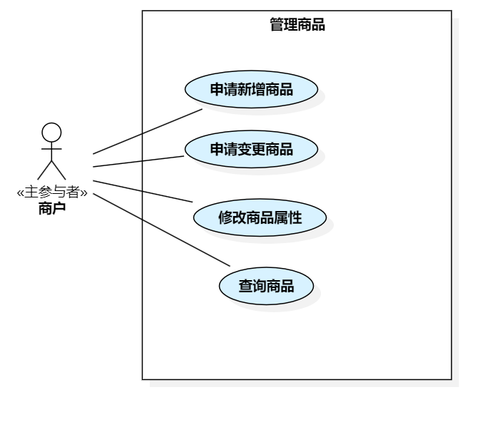
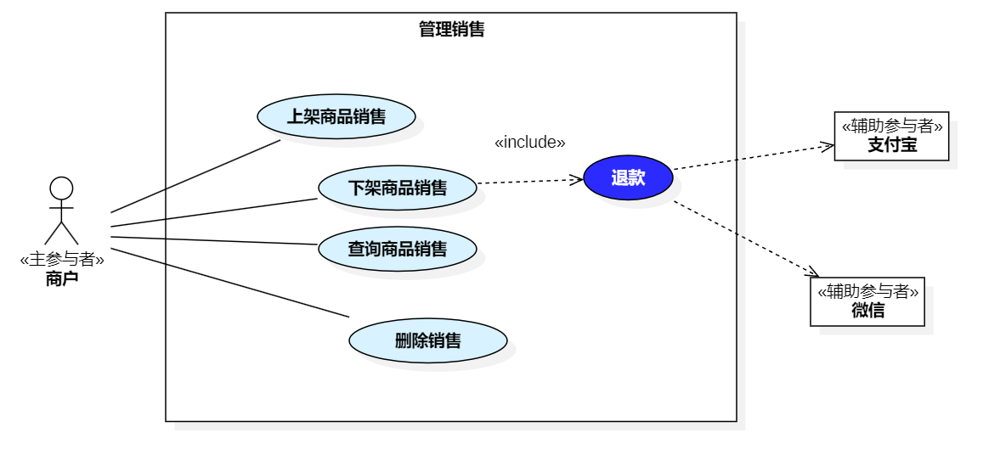
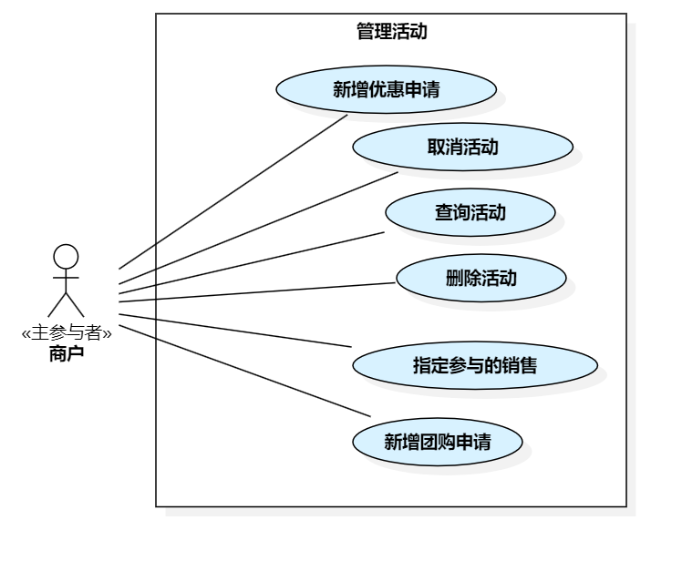
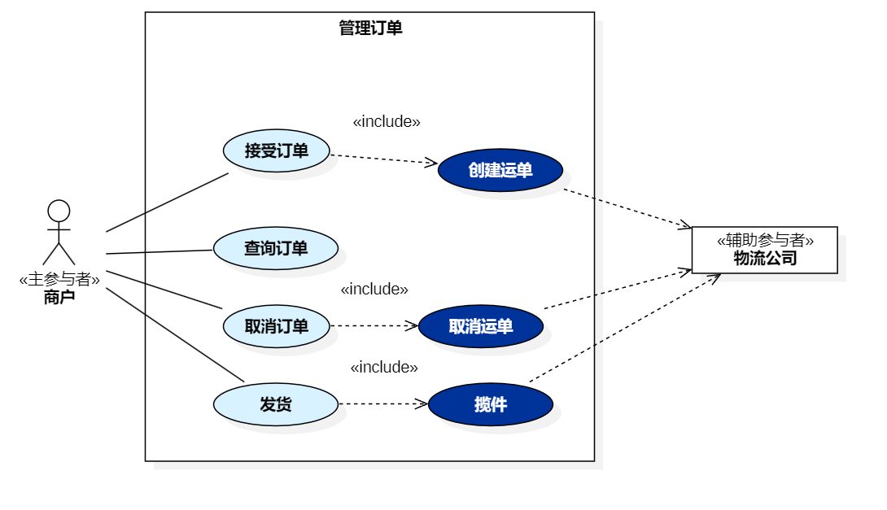
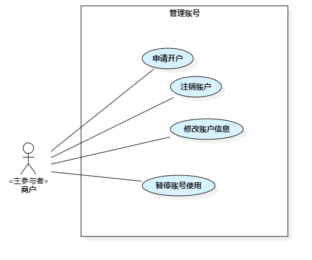
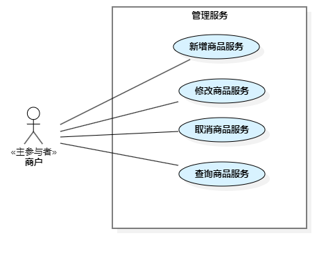
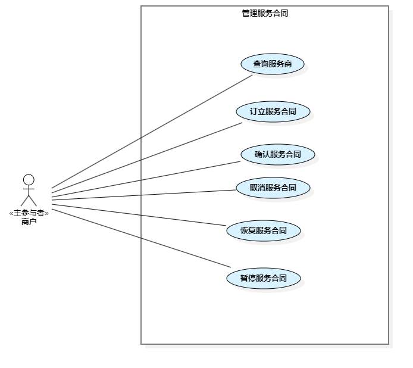
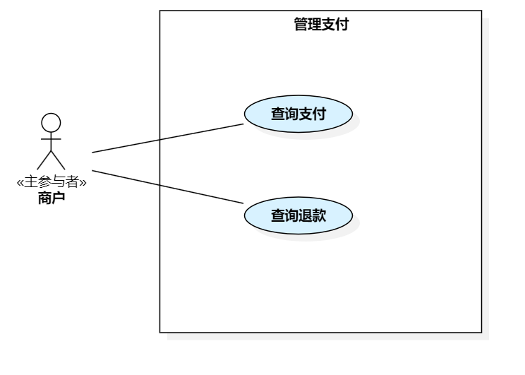
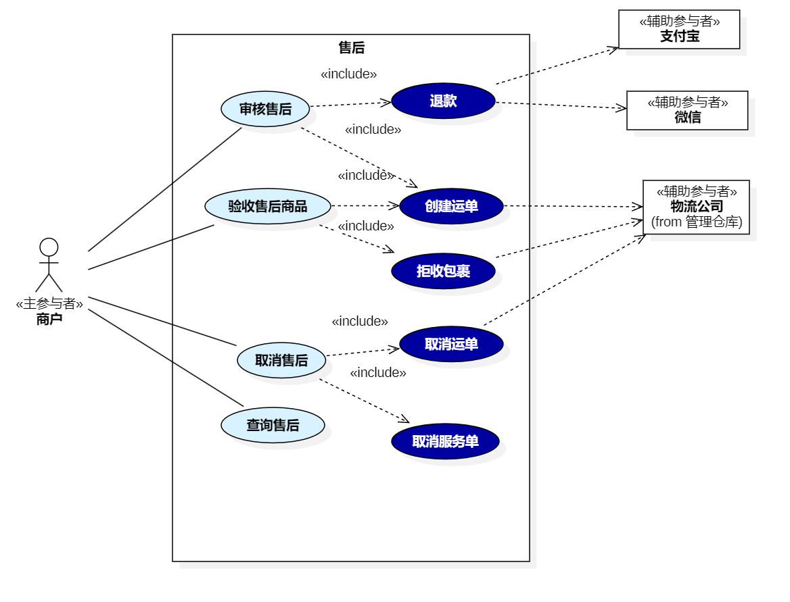

== 3.3 商户

]

=== 3.3.1 管理商品

include::shop/product-mgt/MALL-PRODUCT-004-ApplyNewProduct.adoc[]
include::shop/product-mgt/MALL-PRODUCT-005-ApplyProductChange.adoc[]
include::shop/product-mgt/MALL-PRODUCT-006-QueryProduct.adoc[]
include::shop/product-mgt/MALL-PRODUCT-007-ModifyProductAttributes.adoc[]

=== 3.3.2 管理销售

include::shop/sale-mgt/MALL-PRODUCT-008-ListProduct.adoc[]
include::shop/sale-mgt/MALL-PRODUCT-009-DelistProduct.adoc[]
include::shop/sale-mgt/MALL-PRODUCT-010-QuerySales.adoc[]
include::shop/sale-mgt/MALL-PRODUCT-011-DeleteProductSale.adoc[]

=== 3.3.3 管理活动

include::shop/activity-mgt/MALL-ACTIVITY-020-AddPromotionalActivity.adoc[]
include::shop/activity-mgt/MALL-ACTIVITY-021-CancelActivity.adoc[]
include::shop/activity-mgt/MALL-ACTIVITY-022-QueryActivity.adoc[]
include::shop/activity-mgt/MALL-ACTIVITY-024-SpecifySalesParticipating.adoc[]
include::shop/activity-mgt/MALL-ACTIVITY-025-AddGroupBuyActivity.adoc[]

=== 3.3.4 管理订单

include::shop/order-mgt/MALL-ORDER-003-AcceptOrder.adoc[]
include::shop/order-mgt/MALL-ORDER-004-QueryOrder.adoc[]
include::shop/order-mgt/MALL-ORDER-005-CancelOrder.adoc[]
include::shop/order-mgt/MALL-ORDER-006-ShipOrder.adoc[]

=== 3.3.5 管理账号

include::shop/account-mgt/MALL-SHOP-001-AccountOpening.adoc[]
include::shop/account-mgt/MALL-SHOP-002-AccountCancellation.adoc[]
include::shop/account-mgt/MALL-SHOP-003-ModifyAccount.adoc[]
include::shop/account-mgt/MALL-SHOP-004-ModifyAccountAttributes.adoc[]

=== 3.3.6 管理人员

image::shop/商户-管理人员.png[]

include::shop/staff-mgt/MALL-SHOP-005-AddStaffAccount.adoc[]
include::shop/staff-mgt/MALL-SHOP-006-DeleteStaffAccount.adoc[]
罗芳魁
include::shop/staff-mgt/MALL-SHOP-011-ResumeStaffAccount.adoc[]
罗芳魁
include::shop/staff-mgt/MALL-SHOP-012-QueryStaffAccount.adoc[]
=== 3.3.7 管理服务

宋浩元
include::shop/service-mgt/MALL-SERVICE-001-CreateService.adoc[]
丁培恩
include::shop/service-mgt/MALL-SERVICE-004-QueryService.adoc[]
蔡欣琪
include::shop/service-mgt/MALL-SERVICE-002-UpdateService.adoc[]
马雅欣
include::shop/service-mgt/MALL-SERVICE-003-DelService.adoc[]
=== 3.3.8 管理服务商

罗芳魁
include::shop/servicecontract-mgt/MALL-SERVICE-005-QueryServiceProvider.adoc[]

吴王韬
include::shop/servicecontract-mgt/MALL-SERVICE-008-CancelServiceContract.adoc[]
郑建捷
include::shop/servicecontract-mgt/MALL-SERVICE-009-RecoverServiceContract.adoc[]
郑建捷
include::shop/servicecontract-mgt/MALL-SERVICE-007-ConfirmServiceContract.adoc[]
郑捷捷
include::shop/servicecontract-mgt/MALL-SERVICE-006-CreateServiceContract.adoc[]
郑捷捷
include::shop/servicecontract-mgt/MALL-SERVICE-010-PauseServiceContract.adoc[]
=== 3.3.9 管理支付

=== 3.3.10 管理售后

罗芳魁
include::shop/aftersale-mgt/MALL-AFTERSALE-002-ReviewAftersales.adoc[]
罗芳魁
include::shop/aftersale-mgt/MALL-AFTERSALE-001-QueryAftersales.adoc[]
刘建超
include::shop/aftersale-mgt/MALL-AFTERSALE-090-ReceiveReturnedProduct.adoc[]
吴王韬
include::shop/aftersale-mgt/MALL-AFTERSALE-004-CancelAftersales.adoc[]